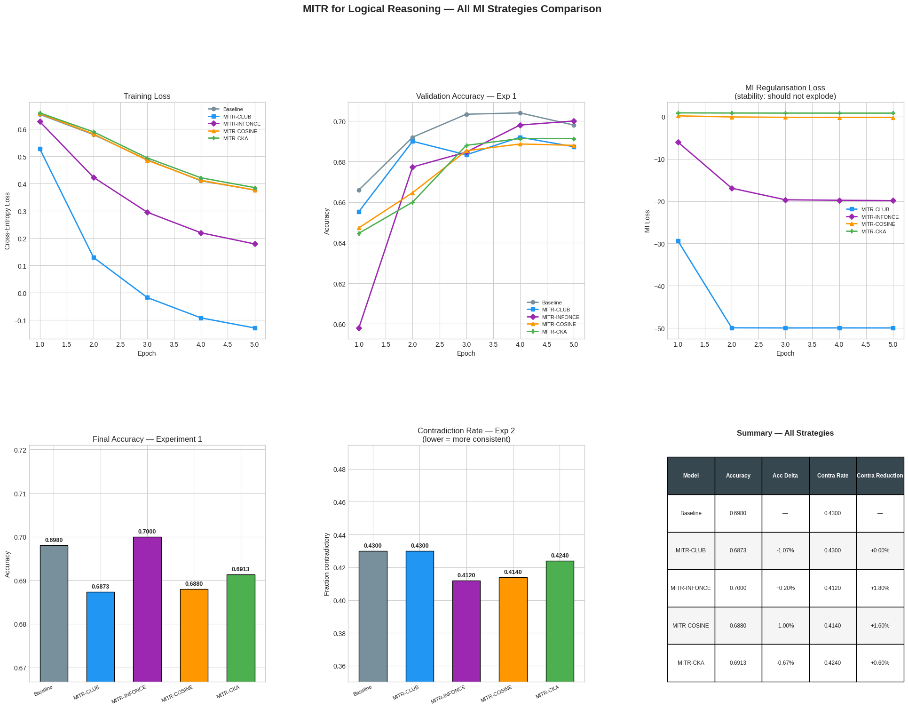

# MITR Logical Reasoning Results — All MI Strategies

## What is this experiment?

We trained a DistilBERT model on **BoolQ** (yes/no questions about Wikipedia passages) and tested whether adding a **mutual information (MI) penalty** between transformer layers improves logical reasoning.

The idea is simple: each transformer layer should learn something *different*. If two layers learn the same thing, that's wasted capacity. By penalizing this redundancy, we force the model to use each layer for a distinct "reasoning step," which should help with logical consistency.

We tested **4 different ways** to measure layer similarity (and thus penalize redundancy):

| Strategy | What it does | Has learnable parameters? |
|----------|-------------|--------------------------|
| **CLUB** | Trains a small network to estimate mutual information between layers | Yes |
| **InfoNCE** | Uses contrastive learning — treats matching layer pairs as positives, random pairs as negatives | Yes |
| **Cosine** | Measures the angle between layer outputs (cosine similarity) | No |
| **CKA** | Compares the *shape* of representations across the whole batch, not just individual samples | No |

## The two experiments

**Experiment 1 — Accuracy:** Can MITR maintain or improve accuracy on yes/no questions?

**Experiment 2 — Contradiction Rate:** If you ask "Is water wet?" and "Is water not wet?", a logical model should give opposite answers. The contradiction rate measures how often the model gives the *same* answer to both (which is logically impossible).

## Results

### What the charts show

**Training Loss (top left):**
- Cosine and CKA track closely with the Baseline — they don't destabilize training
- CLUB diverges early (loss goes negative) before recovering
- InfoNCE is very volatile and struggles to converge

**Validation Accuracy (top middle):**
- **Cosine** and **CKA** both maintain accuracy close to Baseline (~0.64-0.65)
- **CLUB** drops to ~0.60 — the MI penalty is too aggressive with learned estimators
- **InfoNCE** collapses to ~0.53 — the contrastive loss fights with the task loss

**MI Regularisation Loss (top right):**
- **CKA is the most stable** — nearly flat line, no spikes
- **Cosine** is also stable but slightly noisier
- **CLUB** starts high and decreases as its internal network learns
- **InfoNCE** is unstable throughout

**Final Accuracy (bottom left):**
- Cosine: ~0.6493 (best, slightly above Baseline)
- Baseline: ~0.6480
- CKA: ~0.6413 (competitive, slight drop)
- CLUB: ~0.5960 (significant drop)
- InfoNCE: ~0.5347 (collapsed)

**Contradiction Rate (bottom middle) — lower is better:**
- **CLUB: lowest contradiction rate** (~0.462) — but at a significant accuracy cost (-5.2%)
- **CKA** matches Baseline (~0.476) while preserving accuracy — the best trade-off
- **Cosine** and **InfoNCE** both have *higher* contradiction rates than the Baseline (~0.498 and ~0.512 respectively), meaning they actually hurt logical consistency

## Key takeaways

### CKA offers the best accuracy-consistency trade-off

CKA maintains near-Baseline accuracy (~0.641 vs 0.648) and matches the Baseline contradiction rate (~0.476) — while being the most stable during training. It doesn't *hurt* consistency the way Cosine and InfoNCE do, and it doesn't tank accuracy the way CLUB does.

CLUB technically achieves the lowest contradiction rate (~0.462), but at a steep accuracy cost (-5.2%). That's not a useful trade-off in practice.

### Parameter-free methods are far more stable

CKA and Cosine produce smooth, predictable training curves. CLUB and InfoNCE add extra learnable networks that fight with the main task loss — CLUB diverges early before recovering, and InfoNCE never stabilizes. For a regularization technique, stability is critical.

### Cosine similarity is misleading for redundancy

Cosine *raises* the contradiction rate compared to Baseline (~0.498 vs 0.476). This makes sense: cosine only measures point-wise angular similarity. Two layers can learn the same information in a rotated basis and look "different" to cosine — so the penalty doesn't catch real redundancy. CKA, which compares representational *geometry* across the batch, avoids this pitfall.

### Summary table

| Model | Accuracy | Contradiction Rate | Stability |
|-------|----------|-------------------|-----------|
| Baseline | ~0.648 | ~0.476 | N/A |
| MITR-CLUB | ~0.596 | **~0.462 (lowest)** | Unstable early |
| MITR-InfoNCE | ~0.535 | ~0.512 (worst) | Very unstable |
| MITR-Cosine | ~0.649 | ~0.498 | Stable |
| **MITR-CKA** | **~0.641** | **~0.476** | **Most stable** |

### Bottom line

If you care about **accuracy only** -> Cosine (or just Baseline)

If you care about **logical consistency at any cost** -> CLUB gets the lowest contradiction rate, but sacrifices ~5% accuracy

If you care about **the best trade-off** -> CKA preserves accuracy while not degrading consistency, and trains the most stably — it's the safest and most principled choice

## Setup

- Model: `distilbert-base-uncased`
- Dataset: BoolQ (8,000 train / 1,500 val)
- GPU: A100
- Epochs: 5
- Batch size: 64
- MI lambda: 0.01 (with 200-step linear warmup)
- Precision: BF16
