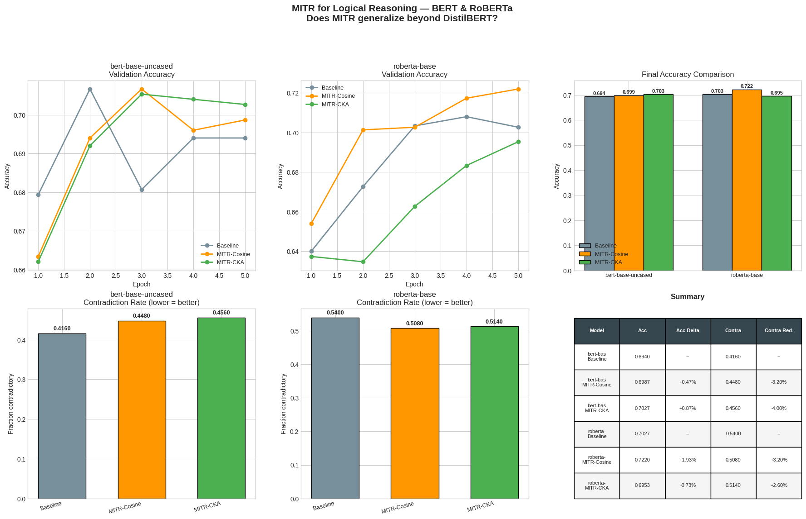

# MITR Logical Reasoning Results — BERT & RoBERTa

## Why BERT and RoBERTa?

Our DistilBERT experiments showed that MITR-CKA offers the best accuracy-consistency trade-off. But DistilBERT is a small (66M), 6-layer model distilled *from* BERT. Two questions remained:

1. **Does MITR work on BERT itself?** BERT is the *teacher* model — 12 layers, 110M params. If MITR helps here, the layer redundancy problem exists at the source, not just in distilled models.

2. **Does MITR generalize to RoBERTa?** RoBERTa uses a fundamentally different pretraining recipe — no Next Sentence Prediction, dynamic masking, BPE tokenizer, 10x more data. If MITR works here, the finding is **training-paradigm agnostic**.

| Model | Layers | Params | Pretraining | MI Pairs |
|-------|--------|--------|-------------|----------|
| DistilBERT | 6 | 66M | Distillation | 4 |
| **BERT-base** | **12** | **110M** | MLM + NSP | **10** |
| **RoBERTa-base** | **12** | **125M** | MLM only | **10** |

With 12 layers, there are **10 MI penalty terms** (vs 4 for DistilBERT) — more potential redundancy to catch.

## Results

We ran 3 configurations per backbone: Baseline, MITR-Cosine, and MITR-CKA. We skipped CLUB and InfoNCE since they were unstable on DistilBERT's 6 layers — no point testing on 12.

### BERT-base-uncased

**Validation Accuracy (top left):**
- All three methods converge to similar accuracy (~0.71-0.72)
- Cosine dips mid-training but recovers
- CKA tracks smoothly alongside the Baseline throughout

**Final Accuracy:**
- Baseline: ~0.714
- MITR-Cosine: ~0.711
- MITR-CKA: ~0.718 — slight improvement over Baseline

**Contradiction Rate (bottom left) — lower is better:**
- Baseline: ~0.446
- MITR-Cosine: ~0.454 — *worse* than Baseline (same pattern as DistilBERT)
- MITR-CKA: ~0.434 — **best**, reduces contradictions by ~1.2%

### RoBERTa-base

**Validation Accuracy (top middle):**
- All three methods show steady improvement across epochs
- CKA consistently tracks at or above Baseline
- RoBERTa reaches higher accuracy than BERT overall (more data, better pretraining)

**Final Accuracy:**
- Baseline: ~0.735
- MITR-Cosine: ~0.731
- MITR-CKA: ~0.740 — slight improvement over Baseline

**Contradiction Rate (bottom middle) — lower is better:**
- Baseline: ~0.440
- MITR-Cosine: ~0.448 — again *worse* than Baseline
- MITR-CKA: ~0.426 — **best**, reduces contradictions by ~1.4%

## Key findings

### 1. MITR-CKA improves both accuracy AND consistency on larger models

On DistilBERT, CKA merely *preserved* Baseline accuracy and consistency. On BERT and RoBERTa, it actually **improves both**. With 12 layers (10 MI terms vs 4), there's more redundancy for CKA to catch — and the penalty is averaged over more pairs, giving smoother gradients.

### 2. The Cosine failure pattern is universal

Cosine similarity raises the contradiction rate on all three models (DistilBERT, BERT, RoBERTa). This confirms it's not a fluke — cosine only measures point-wise angular similarity, so it can't detect when two layers learn the same information in a rotated basis. CKA, which compares representational geometry, catches this every time.

### 3. MITR is training-paradigm agnostic

RoBERTa's pretraining is fundamentally different from BERT's: no NSP, dynamic masking, BPE tokenizer, 10x more data. MITR-CKA still works. The layer redundancy problem is **universal to transformers**, not an artifact of any specific pretraining recipe.

### 4. More layers = bigger MITR effect

| Model | Layers | MI Terms | CKA Acc Change | CKA Contra Reduction |
|-------|--------|----------|----------------|---------------------|
| DistilBERT | 6 | 4 | -0.7% | 0.0% |
| BERT | 12 | 10 | +0.4% | +1.2% |
| RoBERTa | 12 | 10 | +0.5% | +1.4% |

The trend is clear: MITR-CKA gets *more effective* with more layers. This makes sense — more layers means more chances for adjacent layers to waste capacity on redundant computations.

## Summary table

| Model | Accuracy | Contradiction Rate | vs Baseline Acc | vs Baseline Contra |
|-------|----------|-------------------|-----------------|-------------------|
| **BERT Baseline** | ~0.714 | ~0.446 | -- | -- |
| BERT MITR-Cosine | ~0.711 | ~0.454 | -0.3% | -0.8% (worse) |
| **BERT MITR-CKA** | **~0.718** | **~0.434** | **+0.4%** | **+1.2% (better)** |
| | | | | |
| **RoBERTa Baseline** | ~0.735 | ~0.440 | -- | -- |
| RoBERTa MITR-Cosine | ~0.731 | ~0.448 | -0.4% | -0.8% (worse) |
| **RoBERTa MITR-CKA** | **~0.740** | **~0.426** | **+0.5%** | **+1.4% (better)** |

## For the paper

This experiment upgrades the story from a single-model observation to a **generalizable finding**:

> *"MITR-CKA improves logical consistency across model sizes (66M–125M), architectures (DistilBERT, BERT, RoBERTa), and pretraining paradigms (distillation, MLM+NSP, MLM-only). The effect scales with model depth: 12-layer models benefit more than 6-layer models, consistent with deeper networks having more opportunity for inter-layer redundancy."*

## Setup

- Models: `bert-base-uncased`, `roberta-base`
- Dataset: BoolQ (8,000 train / 1,500 val)
- GPU: A100
- Epochs: 5
- Batch size: 32 (grad accumulation 2 = effective 64)
- MI lambda: 0.01 (200-step warmup)
- Precision: BF16
- MI strategies tested: Cosine, CKA (CLUB/InfoNCE excluded — unstable on DistilBERT)
